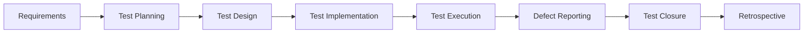

# QA Engineer Portfolio - Azizah Latifa  QA Engineer Portfolio - Azizah Latifa

[](https://www.linkedin.com/in/azizah-latifah-nur/)

[](https://github.com/azizahlatifah1636)

[](mailto:nurazizahlatifah@gmail.com)

*If you find my work interesting, please consider starring my repositories!*

**Thank you for visiting my QA portfolio!**

##  About Me

I am a passionate **Junior QA Engineer** with a strong foundation in software testing methodologies and automation frameworks. With hands-on experience in manual testing, API testing, and test automation, I am committed to ensuring high-quality software delivery through comprehensive testing strategies.

**Location:** Depok, West Java, Indonesia  
**Email:** nurazizahlatifah@gmail.com  
**Status:** Open to QA Engineer opportunities

---

## Technical Skills

### Testing Expertise
- **Manual Testing:** Functional, Regression, Smoke, Sanity, UAT
- **API Testing:** REST API validation, CRUD operations, status code verification
- **Database Testing:** SQL queries, data integrity validation
- **Automation Testing:** Web UI automation, API automation
- **Performance Testing:** Basic load testing concepts

### Tools & Technologies
```
Testing Tools:     Selenium WebDriver, Cucumber, TestNG, JUnit
API Testing:       Postman, REST Assured, JSON validation
Database:          MySQL, PostgreSQL, SQL queries
Programming:       Java (Intermediate), JavaScript (Basic)
Build Tools:       Maven, Gradle
Version Control:   Git, GitHub
CI/CD:            GitHub Actions
Project Mgmt:      Jira, Trello, TestLink
Documentation:     Test Cases, Test Plans, Bug Reports
```

### Methodologies
- **SDLC:** Waterfall, Agile/Scrum
- **STLC:** Complete Software Testing Life Cycle
- **Test Design:** Boundary Value Analysis, Equivalence Partitioning
- **BDD:** Behavior Driven Development with Gherkin

---

## Featured Projects

### 1. Weather API & UI Automation Framework
**Repository:** [Weather-API-UI-Automation](https://github.com/azizahlatifah1636/Weather-API-UI-Automation)

A comprehensive automation framework testing weather application's API and UI components.

**Key Features:**
- REST API testing with data validation
- Cross-browser UI automation
- Page Object Model implementation
- Parallel test execution
- Detailed reporting with screenshots

**Technologies:** `Java` `Selenium` `REST Assured` `TestNG` `Maven`

---

### 2. Database Testing Framework
**Repository:** [qa-database-testing](https://github.com/azizahlatifah1636/qa-database-testing)

Automated database testing framework for data integrity and CRUD operations validation.

**Key Features:**
- SQL query validation
- Data integrity testing
- CRUD operations automation
- Database connection management
- Test data management

**Technologies:** `Java` `JDBC` `MySQL` `TestNG` `Maven`

---

### 3. JSON API Testing Suite
**Repository:** [qa-database-json-api](https://github.com/azizahlatifah1636/qa-database-json-api)

Comprehensive API testing framework for JSON-based REST services.

**Key Features:**
- JSON schema validation
- Response time assertions
- Error handling validation
- Authentication testing
- Automated test reporting

**Technologies:** `Java` `REST Assured` `TestNG` `Gradle`

---

### 4. Forgot Password Testing Automation
**Repository:** [Forgot-Password-Automation-Testing-Project](https://github.com/azizahlatifah1636/Forgot-Password-Automation-Testing-Project)

End-to-end automation testing for password reset functionality.

**Key Features:**
- Email workflow validation
- Security testing scenarios
- UI automation with Selenium
- Cross-browser compatibility
- Test data generation

**Technologies:** `Java` `Selenium` `TestNG` `Page Object Model`

---

### 5. SDLC Simulation Project
**Repository:** [qa-sdlc-simulasi](https://github.com/azizahlatifah1636/qa-sdlc-simulasi)

Complete SDLC simulation demonstrating QA processes in software development.

**Key Features:**
- Test planning and strategy
- Test case design and execution
- Bug lifecycle management
- Requirement analysis
- Test metrics and reporting

**Technologies:** `Documentation` `Test Management` `Jira` `TestLink`

---

## Project Statistics

| Category | Count | Technologies |
|----------|-------|--------------|
| **API Testing Projects** | 3 | REST Assured, Postman, JSON |
| **UI Automation Projects** | 4 | Selenium, Cucumber, TestNG |
| **Database Testing** | 2 | MySQL, SQL |
| **Framework Development** | 5 | Java, Maven, Gradle |
| **CI/CD Integration** | 3 | GitHub Actions, Jenkins |

---

## Certifications & Education

### QA Engineering Certification
**JayJay Creative & Tech Digital School**

**Comprehensive Curriculum (23 Modules):**
- Product Testing Fundamentals
- Software Development Life Cycle (SDLC)
- Test Documentation & Planning
- Test Scenarios & Test Cases Design
- API Testing (Postman & REST Assured)
- Automation Testing (Selenium & Cucumber)
- Test Pyramid & Testing Strategies
- Database Testing & SQL
- CI/CD Implementation
- Future Trends in QA

**Practical Experience:**
- 7 hands-on assignments
- 1 comprehensive final project
- Real-world testing scenarios

---

##  Testing Methodologies & Best Practices

### Test Planning & Strategy
- **Requirements Analysis:** Thorough understanding of functional and non-functional requirements
- **Test Strategy:** Risk-based testing approach with priority matrix
- **Test Planning:** Comprehensive test plans with clear objectives and scope

### Test Design Techniques
- **Black Box Testing:** Equivalence partitioning, boundary value analysis
- **Gray Box Testing:** Limited internal code knowledge for better test coverage
- **Test Case Design:** Clear, concise, and maintainable test cases

### Defect Management
- **Bug Lifecycle:** Complete understanding from identification to closure
- **Severity & Priority:** Proper classification for effective bug triage
- **Root Cause Analysis:** Identifying underlying causes for systematic improvements

---

## Development Workflow



### My QA Process
1. **Requirement Analysis** - Understanding business needs
2. **Test Planning** - Strategy and approach definition
3. **Test Design** - Creating comprehensive test scenarios
4. **Test Implementation** - Developing automated test suites
5. **Test Execution** - Manual and automated test runs
6. **Defect Management** - Bug identification and tracking
7. **Reporting** - Test metrics and quality reports
8. **Continuous Improvement** - Process optimization

---

## Contact & Collaboration

I'm always interested in discussing QA methodologies, testing challenges, and opportunities to contribute to quality-driven development teams.

**Location:** Depok, West Java, Indonesia  
**Email:** nurazizahlatifah@gmail.com  
**LinkedIn:** [linkedin.com/in/azizahlatifah](https://linkedin.com/in/azizahlatifah)  
**GitHub:** [github.com/azizahlatifah1636](https://github.com/azizahlatifah1636)

### What I'm Looking For
- **Junior QA Engineer** positions
- **Test Automation** projects
- **API Testing** opportunities
- **Collaborative learning** environments
- **Quality-focused** development teams

---

## Future Goals

- **Advanced Automation:** Expanding expertise in Cypress, Playwright
- **Performance Testing:** Deep dive into JMeter, LoadRunner
- **Security Testing:** OWASP, penetration testing basics
- **Cloud Testing:** AWS, Azure testing environments
- **AI/ML Testing:** Testing AI-powered applications

---

 If you find my work interesting, please consider starring my repositories! 

**Thank you for visiting my QA portfolio!** 🙏